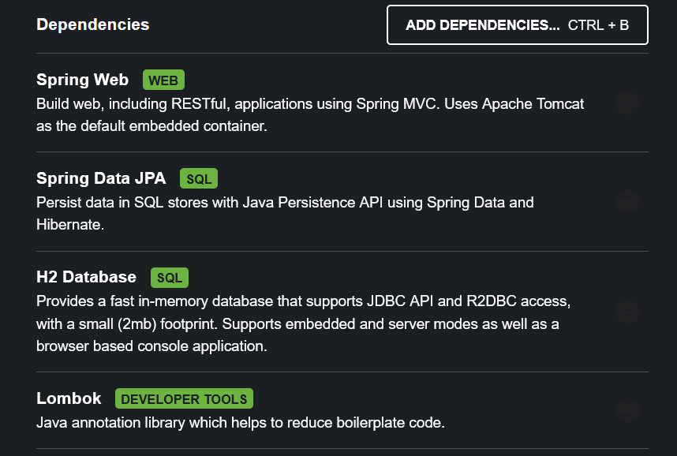
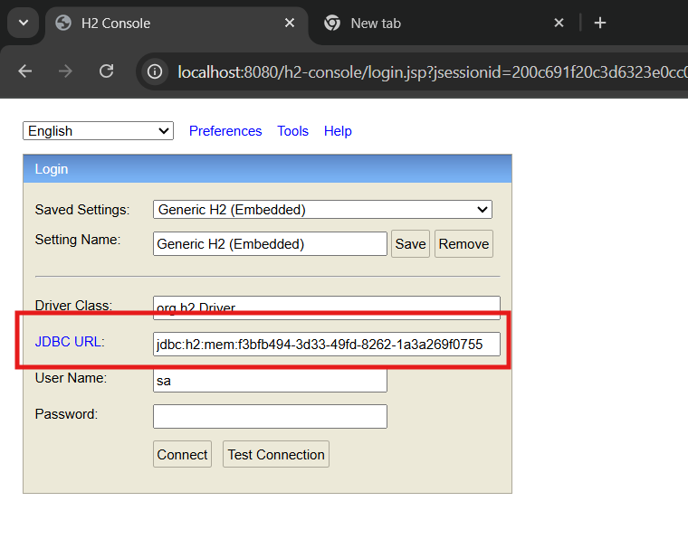
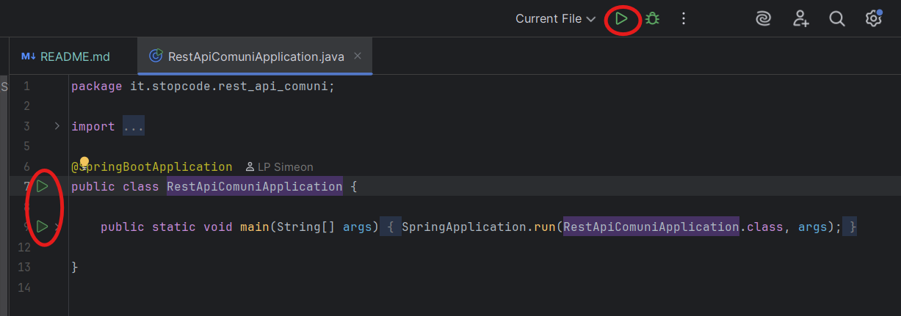
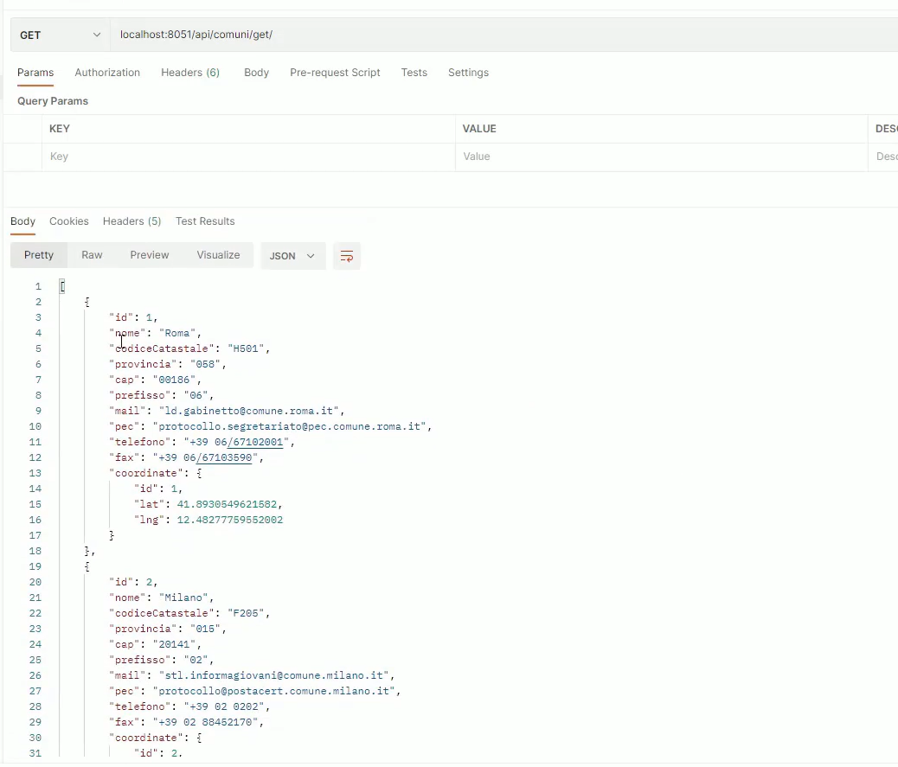
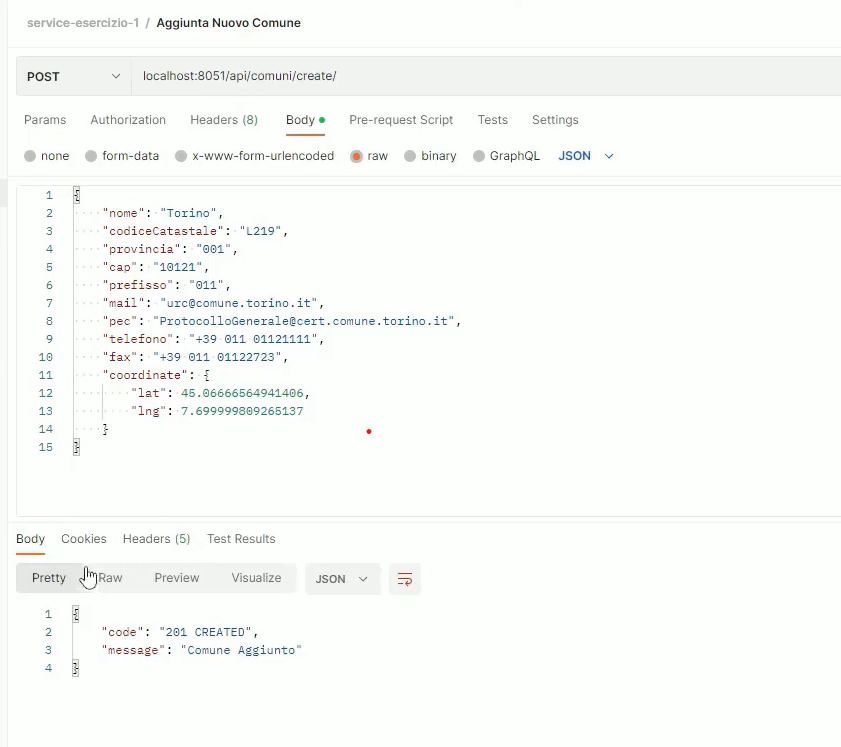
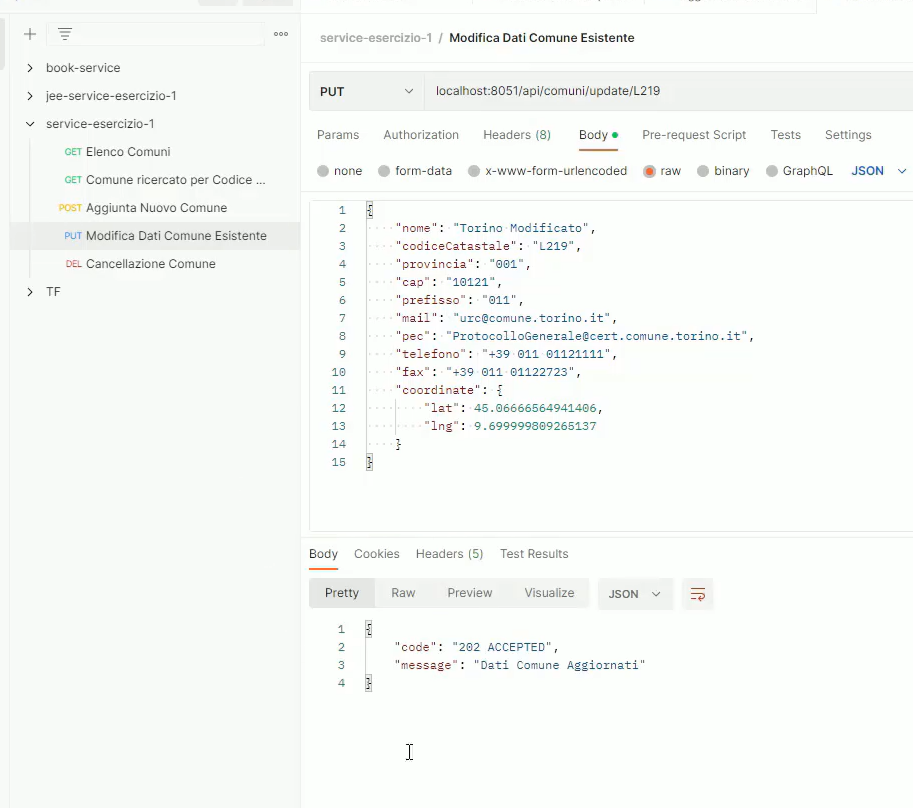

# Configuration

What dependencies I used for the project?

1. `Spring Web`
2. `Spring Data JPA`
3. `H2 database`
4. `Lombok` (to avoid repeatedly writing constructors, getters, and setters)



> [!NOTE]
> If you want to test your queries, you can use the H2 interface if you go to `localhost:8080/h2-console` by adding the specific id you can copy in the startup log (or console log).


then insert the id/url:



and now you can use the interface:


To start the project, please click on the specific button by opening `RestApiComuniApplication`:



## Run the project

In order to test the endpoints, please use GUI clients like Insomnia, Postman, etc...

By running the project, we have access to the following endpoints: 

```bash
Index:
http://localhost:8080/

Endpoints:
http://localhost:8080/api/comuni/get
http://localhost:8080/api/comuni/get/{codiceCatastale} 
http://localhost:8080/api/comuni/create/ (POST)
http://localhost:8080/api/comuni/update/{codiceCatastale} (PUT)
http://localhost:8080/api/comuni/delete/{codiceCatastale} (DELETE)
```

With the following endpoints we can retrieve the list of Comuni, a specific Comune, create a new one, update its information 
and delete one by specifying the cadastral code.

### Endpoint results 

N.1 (GET all Comuni - **GET**):



N. 2 (GET a specific Comune - **GET**):


N. 3 (CREATE a new Comune - **POST**)


N. 4 (UPDATE a specific Comune - **PUT**)


N. 5 (DELETE a specificc Comune - **DELETE**)


> [!IMPORTANT]
> Comune means `Municipality` (Comune == Municipality) 